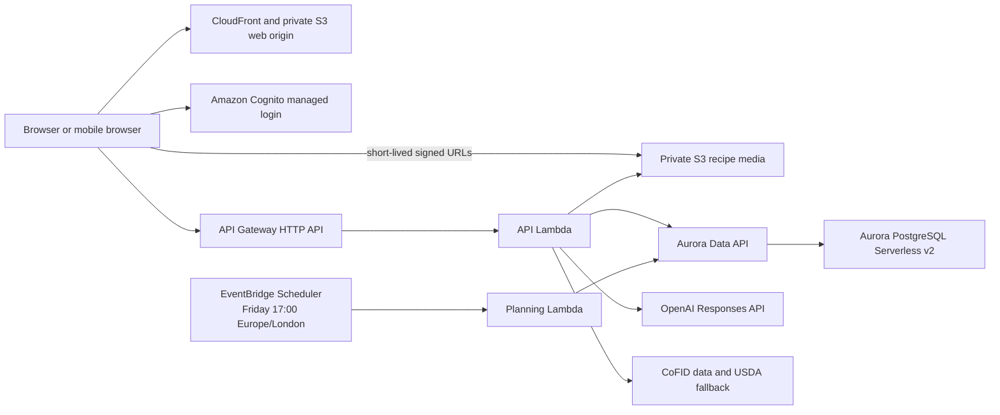

# MacroMap technical architecture

Status: Approved; Phase 2 implemented
Last reviewed: 2026-08-18

## Purpose and authority

This document defines the technical boundaries for the MacroMap MVP. Product
behaviour is defined by `docs/product-requirements.md`; cost constraints are
defined by `docs/cost-model.md`; sequencing and release gates are defined by
`docs/delivery-plan.md`.

If implementation requires violating one of these boundaries, stop and obtain
a human decision before changing the contract or adding infrastructure.

## Architectural drivers

MacroMap is a private application for one authenticated household account and
two planning profiles. It must be deployable and authenticated from the first
vertical slice, run almost entirely on demand, and cost as little as practical
when idle.

The MVP therefore favours:

- serverless, scale-to-zero infrastructure;
- a TypeScript modular monolith rather than distributed services;
- deterministic domain logic for nutrition, planning, scaling, and groceries;
- managed authentication and encrypted managed storage;
- one production environment plus local development;
- explicit limits instead of unbounded autoscaling; and
- CI-only deployments authorised by a reviewed merge to `main`.

The application assumes internet connectivity. A slower first request after an
idle period is an accepted trade-off for allowing PostgreSQL to pause.

## System context



## Technology baseline

- Language: TypeScript in strict mode.
- Runtime: current supported Node.js LTS.
- Repository: npm workspaces in a single repository.
- Web application: React and Next.js, statically exported.
- API: API Gateway HTTP API backed by AWS Lambda.
- Validation: Zod at every external boundary.
- Persistence: Aurora PostgreSQL Serverless v2 and Drizzle ORM.
- Infrastructure: AWS CDK in TypeScript.
- Tests: Vitest for unit/integration tests and Playwright for critical browser
  journeys.

Dependency versions are selected during initial repository setup and pinned by
the lockfile. Replacing these choices or introducing another runtime, database,
framework, ORM, cloud, or paid service is an architectural change.

## Repository shape

The intended layout is:

```text
apps/
  web/                 Next.js static web application
  api/                 Lambda entry points and HTTP adapters
packages/
  domain/              Pure business rules and planner
  contracts/           API request/response schemas
  database/            Drizzle schema, repositories, and reviewed SQL files
infra/                  AWS CDK application and assertions
docs/                   Product, architecture, cost, and delivery contracts
```

Packages are boundaries inside one modular monolith, not independently
deployed services. Domain code must not import AWS SDKs, HTTP adapters, or
database implementations.

## AWS deployment

### Regions and DNS

Application resources live in `eu-west-2`. The CloudFront certificate lives in
`us-east-1`, as required by CloudFront. The public application address is
`macromap.chrismatthews.me`.

The existing `chrismatthews.me` public hosted zone is reused. MacroMap must not
create another hosted zone. If the zone cannot be accessed from the deployment
account, deployment stops and reports the required DNS record for a human to
create.

The existing hosted-zone identifier is non-secret deployment configuration
committed with the CDK application. CDK resolves the account from the
authenticated deployment role; GitHub stores only that role's ARN.

### Web application

The Next.js application is statically exported to a private S3 bucket served
through CloudFront using Origin Access Control. Static files are not sensitive;
all application data remains behind the authenticated API.

Server-side rendering, edge functions, and a continuously running Next.js
server are excluded unless a later requirement demonstrates a need for them.

### Authentication and authorisation

Amazon Cognito provides one household login through its managed login pages,
using the authorisation-code flow with PKCE and no client secret in the browser.
Chris and Alex are application-level planning profiles, not separate Cognito
users in the MVP.

Public self-registration is disabled. The human owner created the initial
Cognito user and bound its immutable `sub` to the seeded household during the
first release on 17 August 2026. The one-time executable used for that operation
has been removed. Subsequent account recovery uses Cognito's managed flow. A
different `sub` cannot replace the existing household binding without a
separately reviewed data operation.

API Gateway validates Cognito JWTs. The API derives the authenticated actor from
the validated `sub` claim and never accepts an account identifier supplied by
the browser as proof of ownership. Repository queries must remain scoped to the
authenticated household even though the MVP has only one household.

### API and compute

API Gateway exposes a versioned `/v1` JSON API. One ARM64 Lambda handles
interactive API requests. A second ARM64 Lambda invokes the same application
services for scheduled weekly planning. Separate entry points provide distinct
timeouts, concurrency limits, and least-privilege permissions without splitting
the domain into services.

The API is stateless. Slow or resumable work must be represented by an
idempotent application operation before another queue or orchestration service
is considered. No queue or Step Functions workflow is required for the MVP.

### PostgreSQL

Aurora PostgreSQL Serverless v2 is configured with:

- Aurora Standard storage;
- minimum capacity of `0` ACUs;
- maximum capacity of `1` ACU;
- automatic pause after five minutes of inactivity;
- one writer and no read replica;
- encrypted storage and an RDS-managed secret;
- the Data API enabled; and
- deletion protection and a retained final snapshot in production.

Lambda accesses PostgreSQL through the Data API. This avoids a NAT Gateway,
RDS Proxy, persistent connection pool, and Lambda VPC attachment, while allowing
the cluster to pause. The UI must tolerate database resume latency and show a
clear waking/retry state rather than treating the first timeout as data loss.

Database structure is represented by the Drizzle schema. The committed initial
SQL records the schema and household data used for the first release and creates
fresh databases for local integration tests. It was applied to production once,
on 17 August 2026, and must never be reapplied there.

Production now contains real data. Schema changes use reviewed, forward-only
SQL files under `packages/database/sql/updates`. The human owner applies each
file manually before the code that depends on it is merged. A data migration is
needed only when existing records must be transformed; Phase 2's nullable macro
and photo-marker columns do not require one. No schema runner is included until
repeated changes demonstrate a need for it.

### Object storage

Recipe photos are stored in a separate private S3 bucket. The API issues
five-minute signed upload and download operations after authorisation. Uploads
are staged until the API verifies a maximum size of 5 MiB and a JPEG, PNG, or
WebP file signature. Valid photos replace the recipe's single object; abandoned
staging objects expire after one day. Imports retain source attribution; copied
images are never assumed to be the source of recipe truth. A neutral bundled
placeholder is used when a recipe has no photo.

Server-side URL and image fetching accepts only HTTP(S), applies strict time and
byte limits, validates content type, and sends no user cookies or credentials.
It resolves and revalidates every redirect target and rejects loopback, private,
link-local, metadata-service, and other non-public addresses. Uploaded images
are checked by file signature rather than trusting the supplied extension or
content type. The bucket blocks public access, uses S3-managed encryption, has
no replication or versioning, and is retained during an ordinary rollback.

### Scheduling

One EventBridge Scheduler schedule runs at 17:00 every Friday using the
`Europe/London` timezone. The scheduler therefore follows GMT/BST changes.

Generation is idempotent. A unique `(household_id, week_start_date)` database
constraint ensures retries cannot create a second draft for the same week.
Automatic generation creates a draft only; it never approves a plan.

### Configuration and secrets

- The database credential is held in AWS Secrets Manager and managed by RDS.
- The OpenAI API key is held in a Standard SSM SecureString parameter.
- Non-secret configuration is validated at Lambda startup.
- The static application loads `/config.json` at runtime. Local development
  commits only a `mode=local` seam; CDK generates the production API endpoint,
  Cognito domain, client identifier, and redirect URI during deployment.
- Secrets and tokens must never appear in logs, build artifacts, CloudFormation
  outputs, fixtures, or browser bundles.

## Domain model

The initial relational model should contain these concepts. Names may be
adjusted during detailed schema design without changing their responsibilities.

### Household and profiles

- `household`: the authenticated data boundary.
- `account_identity`: maps a Cognito `sub` to the household.
- `person`: Chris or Alex, including display name, active state, and current
  kcal, protein, carbohydrate, and fat targets.

Targets and all calculated nutrients use decimal values. The 15% snack reserve
is stored as household planning configuration and defaults to `0.15`.

### Recipes

- `recipe`: editable title, description, yield, archive state, optional
  authoritative per-serving nutrition, and a nullable marker for its private
  photo. Source and nutrition provenance are added with the slices that need
  them.
- `recipe_ingredient`: ordered structured ingredient, amount, unit, and
  preparation note. Imported source text is added with recipe imports.
- `recipe_step`: zero or more ordered cooking instructions.
- `recipe_tag`: explicit meal types and editable inferred descriptors.
- estimated nutrition provenance and confidence are introduced with nutrition
  estimation rather than modelled speculatively in the manual-entry slice.
- `ingredient`: canonical identity used for nutrition matching and grocery
  consolidation.
- `ingredient_nutrition_match`: the selected CoFID or USDA match and confidence.
- `recipe_import`: an uncommitted import preview and its warnings.

Original ingredient text and source attribution are preserved even after
normalisation. Imported or inferred data never bypasses the mandatory review
step.

### Weekly plans

- `weekly_plan`: one Monday-to-Sunday plan with `draft` or `approved` status,
  generation diagnostics, and an optimistic-concurrency version.
- `meal_slot`: date, breakfast/lunch/dinner type, and attendance per person.
- `planned_meal`: selected source recipe, per-person quarter-serving portions,
  and combined batch scale.
- `planned_meal_snapshot`: immutable recipe instructions, ingredients,
  nutrition, quantities, and attribution used by that plan revision.
- `grocery_list` and `grocery_item`: generated requirements plus user additions,
  overrides, deletions, and checked state.

Historical status is derived from the plan's week rather than a background
status-changing job. Past meal slots are immutable based on the current
`Europe/London` date; today and future slots remain editable.

## Nutrition and units

The bundled, versioned CoFID dataset is the primary nutrition source for common
UK ingredients. The free USDA FoodData Central API is a fallback for ingredients
that cannot be matched with sufficient confidence. USDA responses and accepted
matches are cached so ordinary planning does not require an external nutrition
request.

The system stores:

- the user's original quantity and unit;
- a normalised decimal quantity where conversion is reliable;
- a measurement dimension such as mass, volume, or count; and
- the conversion/match source and confidence.

Only compatible dimensions and confidently equivalent ingredients are merged
in the grocery list. Ambiguous count-to-weight conversions remain separate and
are shown for review. Display rounding never changes the precise quantity used
for nutrition or grocery calculations.

## Planning engine

Planning is deterministic and runs within the application code. It does not ask
an AI model to select meals or calculate macros.

The MVP uses a bounded, seeded search:

1. Build eligible candidates for every attended meal slot.
2. Reject candidates that violate hard eligibility or portion constraints.
3. Explore recipe and quarter-serving combinations with a bounded beam search.
4. Score complete and partial plans in the exact priority order defined by the
   product requirements.
5. Apply stable tie-breaking using stored identifiers and an explicit seed.
6. Persist the best plan plus machine-readable shortfall diagnostics.

The score must separate hard constraints, lexicographically ordered objectives,
and reporting metrics. A single opaque weighted sum must not allow a lower
priority benefit to overwhelm sensible quantities, macro proximity, or dinner
uniqueness.

Revision requests pin every unaffected meal. The planner first tries the
explicit change alone, then portion changes, then an increasing number of meal
substitutions. It stops at the smallest feasible change set and reports every
consequential edit.

## AI boundary

OpenAI may be used only for:

- fallback extraction when Schema.org recipe data is absent or invalid;
- editable cuisine, protein, and flavour inference; and
- translating a free-text weekly revision into a constrained structured intent.

The default model is the approved low-cost model recorded in the cost document.
Every response must satisfy a versioned Zod/JSON schema, include only permitted
fields, and pass deterministic validation. One bounded retry is allowed for an
invalid response. Invalid or low-confidence output becomes a review warning;
it is never silently persisted or executed.

AI does not provide authoritative nutrition, invent recipes, execute database
operations, approve plans, or decide grocery quantities. Prompts, schemas,
model name, token limits, retries, and fallbacks are versioned application
contracts and cost-sensitive configuration.

## API surface

The detailed schemas will live in `packages/contracts`. The intended resource
surface is:

- `/v1/session`, `/v1/household-settings`, and `/v1/people`
- `/v1/recipes` and `/v1/recipes/{recipeId}`
- `/v1/recipe-imports/preview` and `/v1/recipe-imports/{importId}/save`
- `/v1/weekly-plans/{weekStart}`
- `/v1/weekly-plans/{weekStart}/generate`
- `/v1/weekly-plans/{weekStart}/revise`
- `/v1/weekly-plans/{weekStart}/approve`
- `/v1/weekly-plans/{weekStart}/grocery-list`
- signed recipe-photo upload/download operations

Mutations that can reasonably conflict use optimistic concurrency or
idempotency keys. Household settings are a whole-form, last-write-wins update
for the single-login MVP. Error responses use a shared envelope with a stable
machine-readable code and a safe human-readable message.

Recipes use a client-generated UUID and a whole-document `PUT`, making creation
and retries idempotent without another key mechanism. `GET /v1/recipes` uses an
opaque cursor and returns active recipe summaries; the item endpoint reads,
replaces, or soft-archives one recipe. Ingredient, optional instruction, tag,
and recipe rows are saved in one transaction. Every query derives the household
from the validated Cognito `sub`; an identifier owned by another household is
reported as absent.

## Security and observability

- HTTPS only, with restrictive CORS for `macromap.chrismatthews.me`.
- Least-privilege IAM per Lambda and deployment workflow.
- Encryption at rest for PostgreSQL and S3.
- S3 public-access blocking enabled on every bucket.
- Structured logs without recipe source bodies, tokens, or secret values.
- Treat fetched recipe text as untrusted data, never as instructions to the AI
  or application.
- Fourteen-day application log retention.
- No X-Ray, paid observability platform, or high-cardinality custom metrics in
  the MVP.
- Health checks must not wake PostgreSQL merely to prove that static hosting is
  available.

## Explicit infrastructure exclusions

The MVP must not introduce these without a new approved architecture and cost
decision:

- NAT Gateway or paid VPC endpoints;
- Application Load Balancer;
- ECS, Fargate, App Runner, EKS, or an EC2 application server;
- RDS Proxy or an always-on RDS instance;
- database replicas or a minimum Aurora capacity above zero;
- Step Functions, queues, or event buses beyond the single scheduler;
- a cloud development or staging environment;
- a second Route 53 hosted zone;
- a paid nutrition, search, monitoring, or analytics service; or
- unbounded AI retries, fallback chains, or autoscaling.
